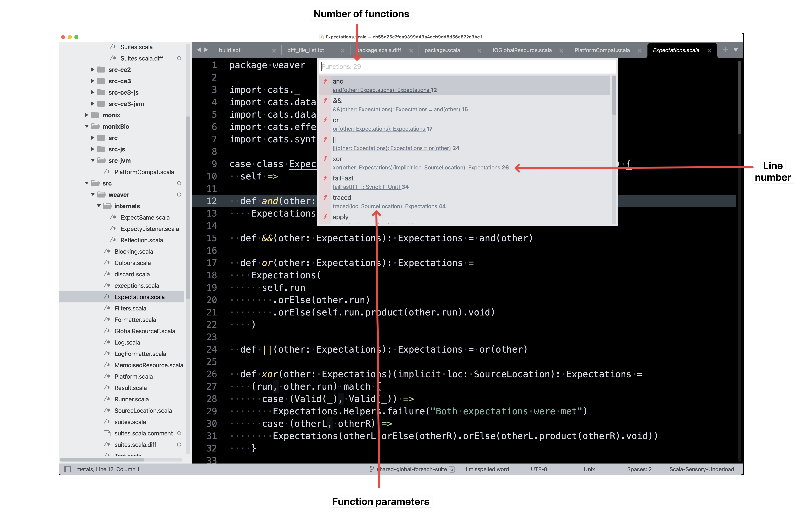
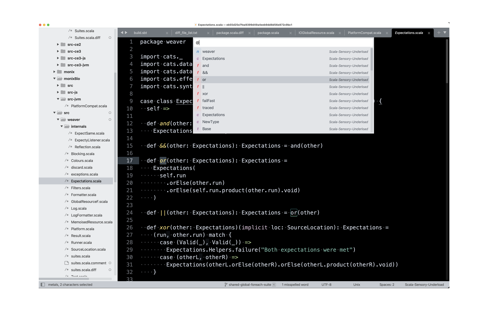
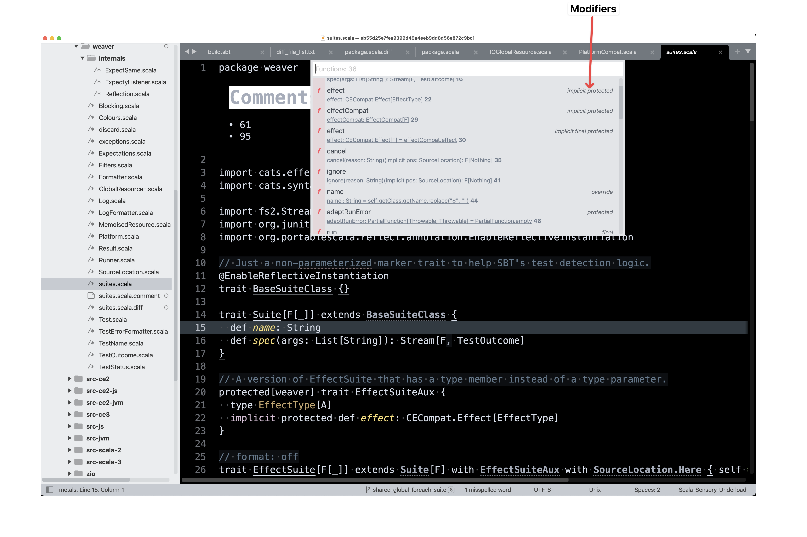
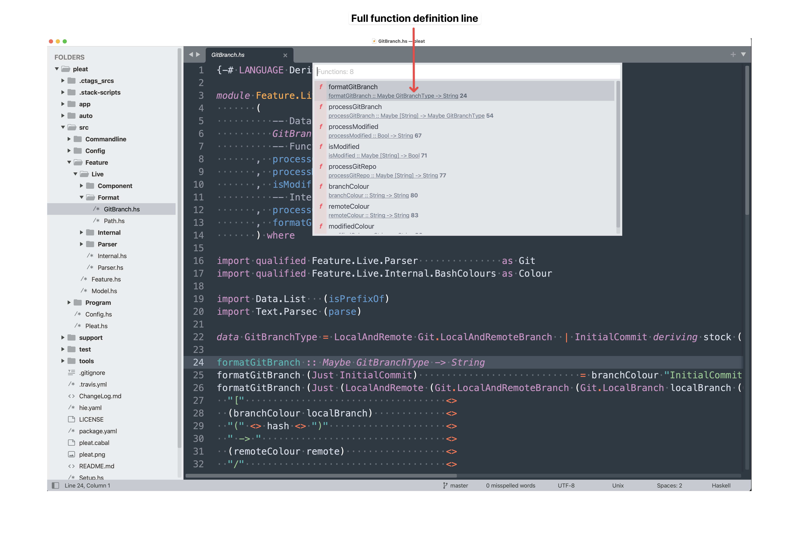
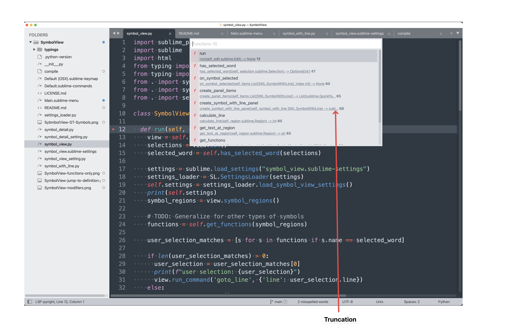

# SymbolView

[Sublime Text](https://www.sublimetext.com/) plugin to search symbols in the current file.



## Installation

- Open the command palette with `CMD + SHIT + P`
- Select `Package Control: Add Repository`
- Enter https://github.com/ssanj/SymbolView for the repository
- Select `Package Control: Install Package`
- Choose SymbolView


## Functionality


In the standard Sublime Text `Goto Symbol` panel (`CMD + R`) you get a list every symbol in your file by default. There is no way to filter the type of symbol, say for example; only show functions. On large files this can be overwhelming when there are lots of functions, variables and types etc.

In addition function symbols don't have any parameter information.



### Search Functions in the Current File

To open a list of functions in the current file press `CMD + SHIFT + R`.


#### Settings

By default the full line containing the function is displayed below the function name. This can be customised with the following settings for a given syntax.

In the example below we specify three settings under `syntaxes`:

- The name of the language syntax setting is for: `scala`
- The names of the Sublime Text syntaxes this should be used for: `Scala` and `Scala-Sensory-Underload`
- Keyword that starts a function. In Scala it's `def`
- Characters used to detect the end of a function. In Scala it's `{` and `=`

```
{
  "syntaxes": [
      {
        "scala": {
          "syntax_names": ["Scala", "Scala-Sensory-Underload"],
          "function_start": "def",
          "function_ends": ["{", "="],
        }
      },
  ]
}
```

Using the above information SymbolView can extra *most* parameter information for a Scala function.



Some __caveats__ are that this does not support multiline parameter lists or for languages that don't have a keyword for a function definition such as `Haskell` or `Elm`. In such cases the full line containing the function definition will be displayed.



### Jump to Function Definition

If you place your cursor on symbol and press `CMD + SHIFT + R`, it jumps to the function definition.


### Truncate Long Function Definitions

If a function definition is too long, say for example with the parameters and return types, then you can specify at what length to truncate the definition with ellipses.



#### Settings

`max_line_length` specifies after how many characters the symbol definition should be truncated at.


